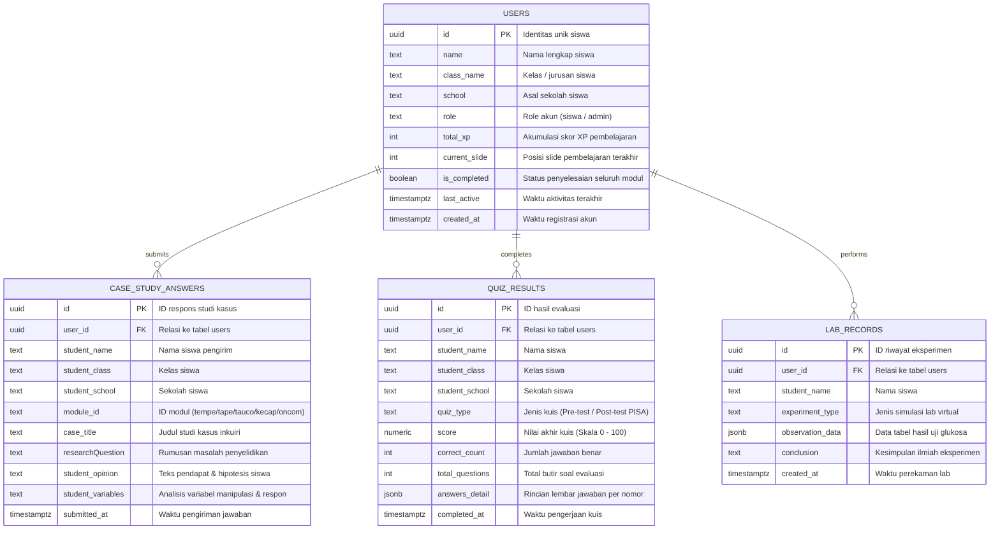

# 📊 DOKUMENTASI SPESIFIKASI & TASK LIST DASHBOARD ADMIN ETNOSAINS
**Aplikasi E-Modul Etnosains Bioteknologi Fermentasi Pangan Tradisional**

---

## 1. 🎯 Ringkasan Eksekutif & Tujuan Arsitektur

Dashboard Admin didesain khusus sebagai **Portal Guru & Tenaga Pendidik** untuk memantau capaian pembelajaran, menganalisis penalaran ilmiah siswa dalam rekonstruksi kearifan lokal, serta merekapitulasi evaluasi literasi sains HOTS PISA secara *real-time* berbasis **Supabase Cloud Database**.

### Keunggulan Arsitektur:
- **Dual User Role**: Siswa (Akses Modul, Kuis, Eksperimen Lab) dan Guru/Admin (Akses Dashboard Monitoring, Analisis Kelas, Koleksi Respon).
- **Offline-First with Cloud Sync**: Aplikasi tetap berfungsi optimal secara lokal dan secara otomatis menyinkronkan data saat terhubung ke internet.
- **Proteksi Akses**: Menggunakan otentikasi PIN/Kata Sandi khusus Guru (`123456`).

---

## 2. 🗄️ Arsitektur Database & Schema Relasi (Supabase Cloud)

---

## 3. 🖥️ Spesifikasi Antarmuka Dashboard Admin (`/admin`)

Dashboard Guru dibangun dengan antarmuka modern, intuitif, dan responsif (mendukung orientasi Landscape & Portrait pada tablet/laptop/smartphone):

### 🏷️ Header Bar & Kontrol:
- **Title**: *Dashboard Guru & Evaluasi Etnosains*
- **Status Indicator**: Indikator lampu hijau aktif (*Real-time Supabase Connected*).
- **Tombol Segarkan (Refresh)**: Memuat ulang data agregasi secara instan dari cloud.
- **Tombol Keluar / Ganti Akun**: Kembali ke rute `/auth` atau ke halaman e-modul siswa.

---

### 📊 Tab 1: Statistik & Ringkasan Kelas (*Class Analytics*)
1. **Grid 4 Kartu Metrik Utama**:
   - **Total Siswa Terdaftar**: Menghitung jumlah akun siswa aktif di database.
   - **Rata-rata Skor Pre-test**: Nilai rata-rata awal sebelum pembelajaran.
   - **Rata-rata Skor Post-test**: Nilai rata-rata evaluasi literasi sains HOTS PISA.
   - **Persentase Kelulusan KKM**: Persentase siswa yang mencapai skor $\ge 75.0$.
2. **Analisis Efektivitas Pembelajaran ($N\text{-Gain}$)**:
   - Menampilkan komparasi skor awal vs skor akhir dan kalkulasi peningkatan kompetensi.
3. **Banner Ringkasan Partisipasi Inkuiri**:
   - Menampilkan total akumulasi teks respons studi kasus yang terkumpul dari seluruh siswa.

---

### 👥 Tab 2: Direktori & Portofolio Siswa (*Student Directory*)
1. **Filter & Search Bar**:
   - Pencarian cerdas berbasis nama siswa dan sekolah.
   - Dropdown filter kelas (*Semua Kelas / XII MIPA 1 / dll*).
2. **Kartu Siswa**:
   - Menampilkan avatar inisial, nama lengkap, kelas, asal sekolah, total XP, status modul, dan nilai evaluasi PISA.
3. **Modal Detail Portofolio Siswa**:
   - Menampilkan riwayat nilai kuis lengkap beserta rincian jumlah jawaban benar/salah.
   - Menampilkan daftar opini dan studi kasus yang telah dijawab oleh siswa terpilih.

---

### 💬 Tab 3: Koleksi Jawaban & Refleksi Siswa (*Student Responses Feed*)
1. **Filter Modul Terpadu**:
   - Pilihan: *Semua Modul*, *Modul 1: Tempe*, *Modul 2: Tape Singkong*, *Modul 3: Tauco*, *Modul 4: Kecap Manis*, *Modul 5: Oncom*, *Jelajah Budaya Nusantara*.
2. **Pencarian Kata Kunci Jawaban**:
   - Mencari argumen/konsep spesifik dalam teks jawaban siswa.
3. **Feed Kartu Respons Siswa**:
   - Header identitas siswa dan cap waktu (*timestamp*).
   - Judul studi kasus & rumusan masalah inkuiri.
   - **Teks Utuh Hipotesis & Pendapat Ilmiah Siswa**.
   - Analisis variabel manipulasi dan respons yang ditentukan siswa.

---

## 4. 📋 Matriks Task List & Status Pengerjaan

| ID Task | Modul / Fitur | Deskripsi Pekerjaan | Status |
| :--- | :--- | :--- | :---: |
| **TSK-01** | Database & Supabase | Konfigurasi 4 tabel (`users`, `case_study_answers`, `quiz_results`, `lab_records`) dengan RLS & Grants | ✅ **SELESAI** |
| **TSK-02** | Supabase Service | Implementasi `lib/core/services/supabase_service.dart` untuk CRUD dan agregasi statistik guru | ✅ **SELESAI** |
| **TSK-03** | Auth & Registrasi | Pembuatan `lib/features/auth/presentation/screens/auth_screen.dart` (Mode Siswa & PIN Guru `123456`) | ✅ **SELESAI** |
| **TSK-04** | Routing & Guard | Pendaftaran rute `/auth`, `/login`, `/register`, `/admin` pada `app_router.dart` | ✅ **SELESAI** |
| **TSK-05** | Admin Dashboard UI | Pembuatan `lib/features/admin/presentation/screens/admin_dashboard_screen.dart` dengan 3 Tab | ✅ **SELESAI** |
| **TSK-06** | Tab Statistik Kelas | Visualisasi 4 metrik, N-Gain score, dan persentase kelulusan KKM | ✅ **SELESAI** |
| **TSK-07** | Tab Data Siswa | Filter kelas, search bar, list siswa, dan modal drilldown lembar jawaban kuis | ✅ **SELESAI** |
| **TSK-08** | Tab Koleksi Jawaban | Filter modul tempe/tape/tauco/kecap/oncom/budaya, search kata kunci opini siswa | ✅ **SELESAI** |
| **TSK-09** | Hook Kuis PISA | Integrasi penyimpanan otomatis hasil kuis PISA ke tabel `quiz_results` di `pisa_quiz_screen.dart` | ✅ **SELESAI** |
| **TSK-10** | Hook Studi Kasus | Integrasi pengiriman opini inkuiri ke tabel `case_study_answers` di `food_detail_screen.dart` | ✅ **SELESAI** |
| **TSK-11** | Drawer & Profil | Update `AppDrawer` dan `CoverScreen` untuk menampilkan identitas siswa & shortcut akses guru | ✅ **SELESAI** |
| **TSK-12** | Sertifikat Dinamis | Integrasi Nama, Kelas, dan Asal Sekolah ke `CertificateViewScreen` dan `CertificateGenerator` PDF | ✅ **SELESAI** |
| **TSK-13** | Validasi & QA | Pengujian `flutter analyze` (0 issue) dan kompilasi Web Server | ✅ **SELESAI** |
| **TSK-14** | Release v1.0.7 | Tagging `v1.0.7` dan sinkronisasi push ke GitHub repository | ✅ **SELESAI** |

---

## 5. 🛡️ Batasan Sistem & Ruang Lingkup (System Limitations & Boundaries)

Untuk memastikan kejelasan batas operasional dan lingkup fungsionalitas aplikasi pada rilis saat ini, berikut adalah batasan-batasan teknis yang berlaku:

### A. Batasan Autentikasi & Keamanan (Security & Access Scope)
1. **Proteksi Akses Guru Berbasis PIN**: Akses ke Dashboard Admin menggunakan PIN/Kata Sandi statis (`123456`), belum menggunakan sistem autentikasi multi-user berbasis Email/Password atau Single Sign-On (SSO) per individu guru.
2. **Karakteristik Hak Akses Admin (Read-Only)**: Dashboard Admin saat ini difokuskan sebagai alat **pemantauan & analisis evaluasi** (*read-only monitoring*). Admin belum dapat mengubah (*edit/update*) jawaban atau nilai yang telah dikirimkan siswa secara langsung dari dashboard.
3. **Pendaftaran Siswa Tanpa Kata Sandi**: Siswa hanya memasukkan *Nama Lengkap, Kelas, dan Nama Sekolah* tanpa verifikasi email atau kata sandi guna mempermudah akses belajar di kelas tanpa hambatan lupa sandi.

### B. Batasan Penyimpanan & Manajemen Konten (Data & Content Scope)
1. **Bank Soal Tersimpan di Kode Aplikasi**: Seluruh naskah butir soal evaluasi HOTS PISA dan studi kasus tersimpan secara statis di aset/kode aplikasi (`PisaQuestionsData`), bukan di tabel database Supabase. Database Supabase hanya mencatat ID pertanyaan, pilihan jawaban, skor, dan waktu submit siswa.
2. **Belum Ada Manajemen Soal Dinamis**: Guru belum dapat menambah, mengedit, atau menghapus butir soal kuis secara langsung melalui dashboard admin (perubahan soal dilakukan melalui pembaruan kode aplikasi).

### C. Batasan Multi-Tenancy & Organisasi Sekolah (Multi-Tenancy Scope)
1. **Single-Project Database**: Seluruh data siswa dari berbagai sekolah tersimpan dalam satu project Supabase yang sama. Pemisahan data dilakukan melalui filter nama sekolah dan kelas, belum berupa isolasi database per sekolah (*multi-tenant database isolation*).

### D. Batasan Jaringan & Sinkronisasi (Network & Offline Scope)
1. **Kebutuhan Koneksi Internet untuk Sinkronisasi**: Pengiriman jawaban studi kasus dan nilai kuis ke dashboard admin memerlukan koneksi internet aktif. Jika perangkat siswa offline, progres disimpan pada penyimpanan lokal perangkat (`SharedPreferences`) dan tidak akan muncul di dashboard admin sampai data disinkronkan saat terhubung ke internet.
2. **Belum Ada Ekspor Berkas Fisik (Excel / CSV)**: Rekapitulasi nilai saat ini disajikan secara visual di layar dashboard dan belum memiliki tombol ekspor langsung menjadi file fisik `.xlsx` atau `.csv`.

---

## 6. 🚀 Roadmap Pengembangan Prioritas (Next Priority Roadmap)

Berdasarkan kebutuhan utama pengelolaan kelas oleh Guru, roadmap pengembangan prioritas berikutnya difokuskan pada 2 fitur utama:

1. 📥 **Fitur Ekspor Rekap Nilai ke Excel / CSV (`.xlsx` / `.csv`)**:
   - Menambahkan tombol unduh laporan rekapitulasi nilai kelas, daftar perolehan skor Pre-test & Post-test PISA, ketercapaian KKM, serta transkrip jawaban studi kasus dalam format spreadsheet Excel / CSV untuk mempermudah pengolahan nilai dan arsip kurikulum guru.

2. 🔔 **Fitur Push Notification / Real-time Live Alert (Supabase Realtime)**:
   - Mengaktifkan fitur *Supabase Realtime Channel Subscription* untuk memberikan notifikasi visual / badge instan pada layar Dashboard Guru ketika ada siswa yang baru saja menyelesaikan kuis evaluasi atau mengirimkan respons analisis studi kasus baru.
