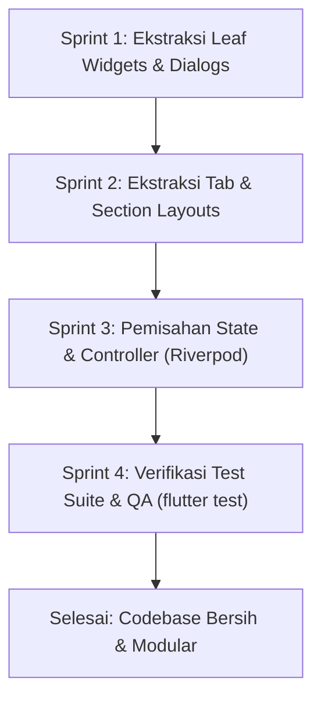

# 🏛️ PANDUAN ARSITEKTUR & MODULARISASI FRONTEND FLUTTER
## Standar Dekomposisi Kode: Mencegah Monolithic God-File & Menjaga Clean Architecture

> **Dokumen Acuan Standar Rekayasa Frontend (Frontend Engineering Standard)**  
> Dibuat untuk mentransformasi file-file berukuran ribuan baris menjadi modul-modul modular, terisolasi, mudah diuji, dan memiliki *single responsibility*.

---

## 📑 DAFTAR ISI
1. [Diagnosa Masalah: Mengapa File Membengkak hingga 1.500+ Baris?](#1-diagnosa-masalah-mengapa-file-membengkak)
2. [Daftar File Monolitik Terbesar (Codebase Audit)](#2-daftar-file-monolitik-terbesar-codebase-audit)
3. [Prinsip Emas Modularisasi Frontend (Golden Rules)](#3-prinsip-emas-modularisasi-frontend-golden-rules)
4. [Struktur Folder Standar Per Fitur (Feature-First Architecture)](#4-struktur-folder-standar-per-fitur)
5. [Anti-Pattern `_buildWidget()` vs Dedicated `StatelessWidget`](#5-anti-pattern-_buildwidget-vs-dedicated-statelesswidget)
6. [Studi Kasus & Blueprint Dekomposisi File Monolitik](#6-studi-kasus--blueprint-dekomposisi-file-monolitik)
   - [Studi Kasus 1: FoodDetailScreen (1.597 ➔ ~120 baris)](#studi-kasus-1-fooddetailscreendart-1597--120-baris)
   - [Studi Kasus 2: AdminDashboardScreen (1.501 ➔ ~150 baris)](#studi-kasus-2-admindashboardscreendart-1501--150-baris)
   - [Studi Kasus 3: PetaKonsepScreen (1.346 ➔ ~130 baris)](#studi-kasus-3-petakonsepscreendart-1346--130-baris)
   - [Studi Kasus 4: AuthScreen (973 ➔ ~100 baris)](#studi-kasus-4-authscreendart-973--100-baris)
   - [Studi Kasus 5: VirtualLabScreen (884 ➔ ~120 baris)](#studi-kasus-5-virtuallabscreendart-884--120-baris)
7. [Aturan Linter & Batasan Baris Kode (`analysis_options.yaml`)](#7-aturan-linter--batasan-baris-kode)
8. [Tahapan Refaktor Bertahap (Sprint Roadmap)](#8-tahapan-refaktor-bertahap-sprint-roadmap)

---

## 1. 🔍 Diagnosa Masalah: Mengapa File Membengkak?

Dalam pengembangan frontend Flutter, sering terjadi fenomena **"God Screen"** atau **"Monolithic Widget"**, yaitu satu file layar (`Screen`) bertanggung jawab atas:
1. **Layout & UI Rendering utama**
2. **Semua sub-komponen UI** (header, tab, kartu, banner, footer)
3. **Semua Dialog, Modal Bottom Sheet, dan Pop-up**
4. **State Management & State Mutasi** (`setState`, `TextEditingController`, Riverpod calls)
5. **Panggilan API & Database (Supabase REST)**
6. **Data statis / Dummy list / Konfigurasi langkah-langkah proses**

### Akibat Buruk File >500 Baris:
* ❌ **Sulit Di-maintain & Di-debug**: Membaca file 1.500 baris memerlukan waktu scroll yang lama dan meningkatkan cognitive load developer.
* ❌ **Merge Conflict Tinggi**: Ketika beberapa developer bekerja di fitur yang sama, satu file besar pasti mengalami konflik git.
* ❌ **Rebuild Tidak Efisien (Performance Drop)**: Ketika satu state berubah, widget raksasa ikut di-evaluasi ulang alih-alih hanya sub-tree kecil yang membutuhkan rebuild.
* ❌ **Sulit Dibuatkan Unit/Widget Test**: Komponen kecil tidak bisa di-test secara terisolasi tanpa me-render seluruh layar.

---

## 2. 📊 Daftar File Monolitik Terbesar (Codebase Audit)

Berdasarkan audit baris kode di proyek ini, berikut adalah 10 file yang perlu didekomposisi:

| No | File Path | Jumlah Baris Saat Ini | Target Pasca Refaktor | Potensi Pemecahan Sub-File |
|---|---|:---:|:---:|---|
| 1 | `lib/features/produk_fermentasi/presentation/screens/food_detail_screen.dart` | **1.597** | **~120** | 6 file komponen (Header, ProcessBox, EthnoBox, FoodCards, CaseStudyAccordion, Dialogs) |
| 2 | `lib/features/admin/presentation/screens/admin_dashboard_screen.dart` | **1.501** | **~150** | 7 file (AdminSummaryCards, StudentTab, QuizTab, CaseStudyTab, LabTab, AnalyticsTab, ExportBar) |
| 3 | `lib/features/peta_konsep/presentation/screens/peta_konsep_screen.dart` | **1.346** | **~130** | 5 file (MicroscopeModal, ConceptHeader, ConceptOverview, MicrobeDetailSheet, TaxonomyNode) |
| 4 | `lib/features/auth/presentation/screens/auth_screen.dart` | **973** | **~100** | 4 file (AuthHeroBranding, StudentLoginForm, AdminLoginForm, AuthSegmentedTabs) |
| 5 | `lib/features/virtual_lab/presentation/screens/virtual_lab_screen.dart` | **884** | **~120** | 5 file (LabControlSliders, DigitalGlucometer, DynamicGlucoseChart, ChemicalEquation, LabObservationLog) |
| 6 | `lib/features/peta_konsep/presentation/widgets/concept_tree_map_widget.dart` | **809** | **~150** | 4 file (TreeNodeCard, TreeEdgePainter, TreeLayoutEngine, TreeLegend) |
| 7 | `lib/features/apersepsi/presentation/screens/apersepsi_screen.dart` | **805** | **~110** | 4 file (ComparisonGrid, DragDropMatcher, ReflectionFormCard, ApersepsiAudioBanner) |
| 8 | `lib/features/cover/presentation/screens/cover_screen.dart` | **637** | **~100** | 3 file (CoverHeroBanner, LearningObjectivesSheet, VideoPengantarDialog) |
| 9 | `lib/features/jelajah_budaya/presentation/widgets/indonesia_map_widget.dart` | **632** | **~120** | 3 file (MapRegionPin, RegionDetailModal, MapCoordinatePainter) |
| 10 | `lib/core/widgets/app_drawer.dart` | **553** | **~90** | 4 file (DrawerUserHeader, DrawerModuleNavigation, DrawerGamificationBadge, DrawerVersionFooter) |

---

## 3. 🎯 Prinsip Emas Modularisasi Frontend (Golden Rules)

### Aturan 1: Batas Maksimal 150–200 Baris Per File
Setiap file Dart dianjurkan memiliki **maksimal 150–200 baris kode**. Jika melebihi 250 baris, file tersebut **wajib** dianalisis untuk dipecah.

### Aturan 2: Single Responsibility Principle (SRP)
Satu file hanya bertanggung jawab atas SATU hal:
- `Screen` ➔ Hanya bertindak sebagai **konduktor/orkestrator layout**.
- `Controller` ➔ Hanya mengelola **state & event logic**.
- `Widget Component` ➔ Hanya menampilkan **satu bagian visual mandiri**.
- `Model/Entity` ➔ Hanya mendefinisikan **struktur data murni**.

### Aturan 3: 3 Tingkatan Komponen (Atomic Separation)
```
┌────────────────────────────────────────────────────────┐
│ 1. Core/Shared Widgets (Global, Reusable lintas Modul) │
│    Contoh: CustomButton, EthnoCard, ModuleNavBar       │
├────────────────────────────────────────────────────────┤
│ 2. Feature Widgets (Spesifik modul tertentu)           │
│    Contoh: DigitalGlucometer, AdminStudentTable        │
├────────────────────────────────────────────────────────┤
│ 3. Screen Orchestrator (Penyusun layar & rute)         │
│    Contoh: VirtualLabScreen, AdminDashboardScreen      │
└────────────────────────────────────────────────────────┘
```

---

## 4. 📁 Struktur Folder Standar Per Fitur

Gunakan struktur **Feature-First Clean Architecture** berikut di setiap folder modul dalam `lib/features/<nama_fitur>/`:

```
lib/features/nama_fitur/
├── data/
│   ├── models/                  # Model data & serialisasi JSON
│   └── datasources/             # Sumber data lokal/remote
├── domain/
│   └── entities/                # Entitas bisnis murni
├── presentation/
│   ├── controllers/             # StateNotifier / Riverpod provider
│   │   └── feature_controller.dart
│   ├── screens/                 # File layar utama (RINGKAS, < 150 baris)
│   │   └── feature_screen.dart
│   └── widgets/                 # Sub-komponen modular (< 120 baris per file)
│       ├── sections/            # Blok layout besar (Header, Body, Summary)
│       ├── cards/               # Kartu informasi khusus
│       ├── dialogs/             # Modal / Alert / Sheet pop-up
│       └── tabs/                # Konten spesifik per tab navigasi
```

---

## 5. 🚫 Anti-Pattern `_buildWidget()` vs Dedicated `StatelessWidget`

### ❌ Cara Buruk: Menggunakan Private Helper Methods di dalam Screen
```dart
// JANGAN LAKUKAN INI DI FILE SCREEN (Menyebabkan ribuan baris & rebuild lambat)
class FoodDetailScreen extends StatefulWidget { ... }

class _FoodDetailScreenState extends State<FoodDetailScreen> {
  @override
  Widget build(BuildContext context) {
    return Column(
      children: [
        _buildHeader(),
        _buildProcessBox(),
        _buildEthnoscience(),
        _buildTraditionalDishes(),
        _buildCaseStudyAccordion(),
      ],
    );
  }

  Widget _buildHeader() { /* 100 baris kode */ }
  Widget _buildProcessBox() { /* 250 baris kode */ }
  Widget _buildEthnoscience() { /* 200 baris kode */ }
  Widget _buildTraditionalDishes() { /* 180 baris kode */ }
  Widget _buildCaseStudyAccordion() { /* 300 baris kode */ }
}
```

### ✅ Cara Benar: Pisahkan ke Sub-Widget Mandiri (`const StatelessWidget`)
```dart
// File: lib/features/produk_fermentasi/presentation/screens/food_detail_screen.dart (< 120 baris!)
class FoodDetailScreen extends ConsumerWidget {
  final String foodId;
  const FoodDetailScreen({super.key, required this.foodId});

  @override
  Widget build(BuildContext context, WidgetRef ref) {
    final food = ref.watch(foodDetailProvider(foodId));

    return EthnoScaffold(
      title: '${food.name.toUpperCase()} & MAKANAN TRADISIONAL',
      body: SingleChildScrollView(
        child: Column(
          children: [
            FoodTopHeaderBanner(food: food),
            const SizedBox(height: 14),
            FoodProcessFlowchartSection(food: food),
            const SizedBox(height: 14),
            FoodEthnoscienceSection(food: food),
            const SizedBox(height: 14),
            FoodTraditionalDishesSection(food: food),
            const SizedBox(height: 14),
            FoodCaseStudyAccordion(food: food),
          ],
        ),
      ),
    );
  }
}
```

#### 💡 Mengapa `StatelessWidget` Jauh Lebih Baik?
1. **Dukungan `const` Constructor**: Flutter melewati (*short-circuit*) proses render widget yang tidak berubah.
2. **Rebuild Terisolasi**: Jika state di dalam `FoodCaseStudyAccordion` berubah saat siswa mengetik, hanya akordion tersebut yang di-rebuild, bukan seluruh layar `FoodDetailScreen`.
3. **Navigasi Kode Mudah**: Setiap bagian memiliki file terpisah yang bisa dibuka langsung lewat `Ctrl + P` di VS Code / IDE.

---

## 6. 🛠️ Studi Kasus & Blueprint Dekomposisi File Monolitik

---

### Studi Kasus 1: `food_detail_screen.dart` (1.597 ➔ ~120 baris)

#### Struktur Baru:
```
lib/features/produk_fermentasi/
├── presentation/
│   ├── screens/
│   │   └── food_detail_screen.dart                 (~110 baris)
│   └── widgets/
│       ├── sections/
│       │   ├── food_top_header_banner.dart         (~60 baris)
│       │   ├── food_process_flowchart_section.dart (~140 baris)
│       │   ├── food_ethnoscience_section.dart      (~120 baris)
│       │   ├── food_traditional_dishes_section.dart (~100 baris)
│       │   └── food_did_you_know_banner.dart       (~50 baris)
│       ├── cards/
│       │   ├── food_process_step_item.dart         (~80 baris)
│       │   └── food_product_card.dart              (~85 baris)
│       ├── dialogs/
│       │   ├── step_detail_dialog.dart             (~90 baris)
│       │   └── traditional_food_info_dialog.dart   (~95 baris)
│       └── case_study/
│           └── food_case_study_accordion.dart      (~160 baris)
```

---

### Studi Kasus 2: `admin_dashboard_screen.dart` (1.501 ➔ ~150 baris)

#### Struktur Baru:
```
lib/features/admin/
├── presentation/
│   ├── controllers/
│   │   └── admin_dashboard_controller.dart        (~140 baris - Riverpod State)
│   ├── screens/
│   │   └── admin_dashboard_screen.dart            (~130 baris)
│   └── widgets/
│       ├── summary/
│       │   ├── admin_metrics_summary_grid.dart    (~95 baris)
│       │   └── admin_live_realtime_badge.dart     (~45 baris)
│       ├── tabs/
│       │   ├── admin_students_tab.dart            (~160 baris)
│       │   ├── admin_quiz_results_tab.dart        (~170 baris)
│       │   ├── admin_case_study_tab.dart          (~165 baris)
│       │   ├── admin_lab_records_tab.dart         (~150 baris)
│       │   └── admin_analytics_charts_tab.dart    (~160 baris)
│       ├── dialogs/
│       │   ├── student_portfolio_modal.dart       (~140 baris)
│       │   └── export_progress_dialog.dart        (~70 baris)
│       └── components/
│           ├── admin_search_filter_bar.dart       (~80 baris)
│           └── admin_data_table_wrapper.dart      (~100 baris)
```

---

### Studi Kasus 3: `peta_konsep_screen.dart` (1.346 ➔ ~130 baris)

#### Struktur Baru:
```
lib/features/peta_konsep/
├── presentation/
│   ├── screens/
│   │   └── peta_konsep_screen.dart                (~120 baris)
│   └── widgets/
│       ├── header/
│       │   └── concept_map_header_banner.dart     (~70 baris)
│       ├── tree/
│       │   ├── concept_tree_map_widget.dart       (~150 baris)
│       │   ├── concept_node_card.dart             (~90 baris)
│       │   └── concept_tree_connector_painter.dart (~110 baris)
│       ├── microscope/
│       │   ├── virtual_microscope_simulator.dart  (~140 baris)
│       │   └── microscope_lens_view.dart          (~85 baris)
│       └── dialogs/
│           └── microorganism_detail_sheet.dart    (~120 baris)
```

---

### Studi Kasus 4: `auth_screen.dart` (973 ➔ ~100 baris)

#### Struktur Baru:
```
lib/features/auth/
├── presentation/
│   ├── controllers/
│   │   └── auth_form_controller.dart              (~80 baris)
│   ├── screens/
│   │   └── auth_screen.dart                       (~95 baris)
│   └── widgets/
│       ├── auth_hero_branding_column.dart         (~90 baris)
│       ├── auth_segmented_nav_bar.dart            (~75 baris)
│       ├── student_registration_form.dart         (~130 baris)
│       ├── admin_login_form.dart                  (~110 baris)
│       └── auth_cloud_sync_status_badge.dart      (~40 baris)
```

---

### Studi Kasus 5: `virtual_lab_screen.dart` (884 ➔ ~120 baris)

#### Struktur Baru:
```
lib/features/virtual_lab/
├── presentation/
│   ├── controllers/
│   │   └── virtual_lab_controller.dart            (~100 baris)
│   ├── screens/
│   │   └── virtual_lab_screen.dart                (~115 baris)
│   └── widgets/
│       ├── simulator/
│       │   ├── lab_control_panel_card.dart        (~140 baris)
│       │   ├── digital_glucometer_display.dart    (~110 baris)
│       │   └── chemical_reaction_formula_box.dart (~60 baris)
│       ├── charts/
│       │   └── dynamic_glucose_line_chart.dart    (~130 baris)
│       └── logs/
│           ├── lab_observation_conclusion_box.dart (~110 baris)
│           └── lab_cloud_save_button.dart         (~65 baris)
```

---

## 7. ⚙️ Aturan Linter & Batasan Baris Kode (`analysis_options.yaml`)

Untuk mencegah penambahan file panjang di masa mendatang, kita dapat menambahkan aturan linting pada [`analysis_options.yaml`](analysis_options.yaml):

```yaml
# Tambahan aturan di analysis_options.yaml
analyzer:
  language:
    strict-casts: true
    strict-inference: true

linter:
  rules:
    - avoid_unnecessary_containers
    - prefer_const_constructors
    - prefer_const_declarations
    - prefer_const_literals_to_create_immutables
    - sized_box_for_whitespace
    - use_colored_box
    - prefer_single_quotes
    - avoid_print
    - unnecessary_string_interpolations
    - prefer_is_empty
    - prefer_is_not_empty
```

> 💡 **Rekomendasi CI/CD Script**: Buat skrip pengecekan otomatis pada pull request untuk menolak file `.dart` baru yang memiliki lebih dari **300 baris kode**:
> ```bash
> # Cek file dart yang melebihi 300 baris
> find lib -name "*.dart" -exec wc -l {} + | awk '$1 > 300 {print $2 " memiliki " $1 " baris! (Maksimal 300 baris)"}'
> ```

---

## 8. 🗺️ Tahapan Refaktor Bertahap (Sprint Roadmap)

Agar proses perapihan tidak merusak fungsi aplikasi (*zero regression*), refaktor harus dilakukan secara bertahap dengan mematuhi test suite:



### Checklist Eksekusi:
- [ ] **Fase 1 (Quick Win: Dialogs & Modals)**:
  - Pindahkan semua `showDialog` dan `showModalBottomSheet` dari file screen ke folder `widgets/dialogs/`.
- [ ] **Fase 2 (Komponen UI Kartu & Banner)**:
  - Ekstrak widget kartu kecil, banner, dan header ke folder `widgets/cards/` dan `widgets/sections/`.
- [ ] **Fase 3 (Tabs & Konten Kompleks)**:
  - Pecah `AdminDashboardScreen` dan `FoodDetailScreen` menjadi tab-tab mandiri di `widgets/tabs/`.
- [ ] **Fase 4 (State & Controller)**:
  - Pindahkan logic panggilan `SupabaseService` dan validasi form ke `controllers/` atau provider Riverpod.
- [ ] **Fase 5 (Testing & Verifikasi)**:
  - Jalankan `flutter test` dan pastikan seluruh 7 test suite tetap hijau (**100% Passed**).

---

*Dokumen ini dibuat oleh Frontend Engineering Team E-Modul Etnosains sebagai standar baku arsitektur kode aplikasi.*
